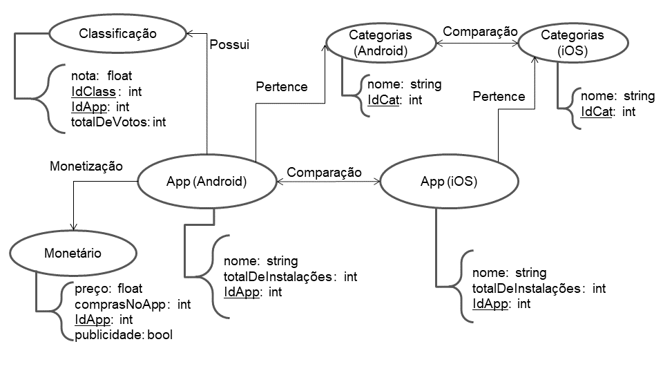

# Aluno
* `240013`: `Lucas Jacinto Gonçalves`

## Modelo Lógico do Banco de Dados de Grafos
> 

## Perguntas de Pesquisa/análise

> Liste aqui as três perguntas de pesquisa/análise
> * A categoria do aplicativo Android mais bem classificado (avaliado) possui monetização ? 
> * A qual categoria pertence o aplicativo Android mais bem avaliado, porém que não possui monetização ? 
> * Para um mesmo aplicativo, qual a quantidade de instalações em cada sistema operacional (Android vs iOS) ? Esse aplicativo é bem avaliado no sistema Android ? Qual a sua classificação (avaliação) no sistema da Google ?
