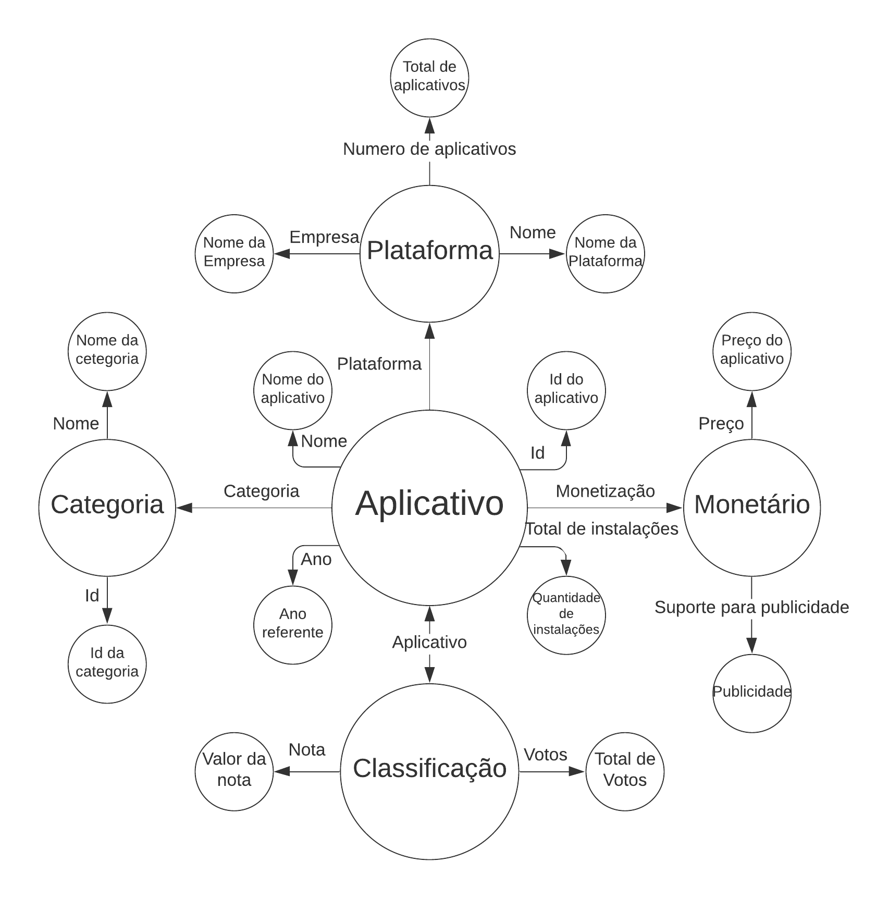

# Aluno
* 240013: Lucas Jacinto Gonçalves

## Grafo de conhecimento
> 

## Perguntas de Pesquisa/Análise

> * Para um mesmo aplicativo de ambas as plataformas (Android e iOS) que permite publicidade, qual loja é mais rentável para a empresa disponibilizar suas propagandas ?
> * Para um mesmo aplicativo de ambas as plataformas (Android e iOS), porém que seja gratuito em uma loja e pago em outra, a classificação dele é melhor quando é pago ? 
> * Quais as categorias de aplicativos mais bem avaliados considerando os anos de 2019 e 2021 na plataforma Android que obtiveram crescimento nesse período ? Esses aplicativos são em sua maior parte gratuitos ou pagos ?

