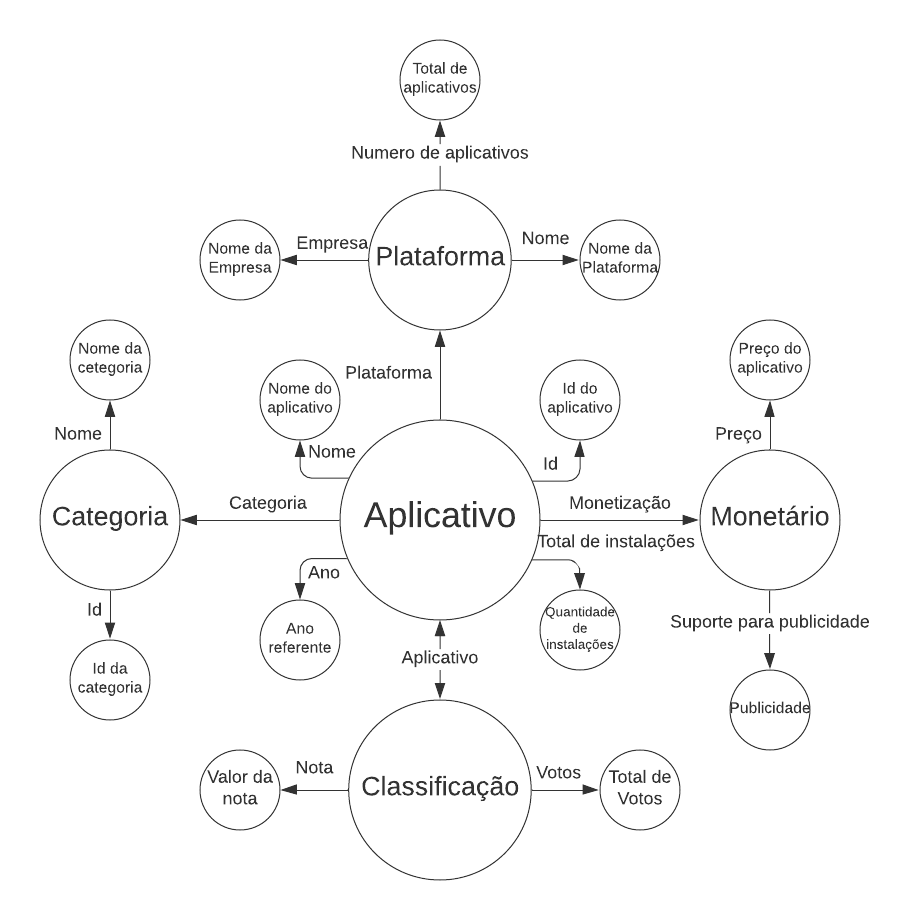

# Aluno
* 240013: Lucas Jacinto Gonçalves

## Grafo de conhecimento
> 

## Perguntas de Pesquisa/Análise

> * Para um mesmo aplicativo de ambas as plataformas (Android e iOS) que permite publicidade, qual loja é mais rentável para a empresa disponibilizar suas propagandas ?
> * 
> * 

